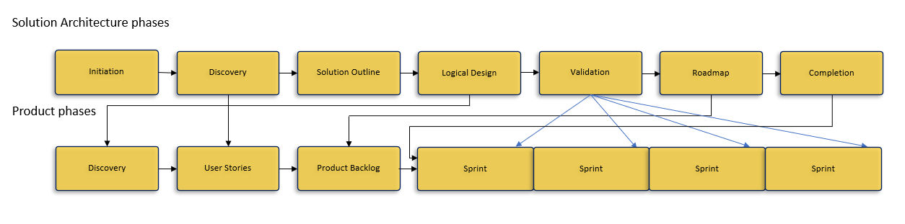

# APL_psa

## Context:

Our client runs a high volume B2B trading operation with large suppliers and business customers. We have provided a trading platform and other solutions for our client since 2016 (having provided solutions for other clients since 2007). 

## Scenario:

We have been asked to build a messaging application for use by our client to support operational dialogue with their suppliers and customers.

You have been asked to scope out the project and to consider different solution options. You have direct access to both the business client and technical teams.

### What would your initial steps be?

* More context

    Capabilities of the provider

* Align solution within business and IT strategy

    VMOST

    | Initial | word      | Business/IT |
    |---------|-----------|-------------|
    | V       | Vision    |  BBBBB      |
    | M       | Mission   |  BBBBB      |
    | O       | Objective |  BBBB/T     |
    | S       | [Strategy](#2)  |  BBB/TT     |
    | T       | [Tactics](#3)   |  B/TTTT     |

    The Scenario exists at the level of a strategy, a messaging application, and an objective which is to support operational dialogue with suppliers and customers.

    Is the objective extant, or is it a new objective? The context would lead to an assumption of the objective being extant. Much as we wish to talk about the journey into the future we should [map the territory](#1) where we are.

    ~~*“I wouldn’t start from here if I were you.”*~~

    The [strategy](#2) is a change state to the objective, strategy is the vector to the objective's scalar. Here we begin to [map a territory](#2) that does not yet exist.

    The [tactics](#3) are the means by which which areas of our map of the territory to be built are sketched out.

    
* Solution architecture inputs.

    #### 1 .
    Background documentation: Model the existing actors that suport the objective; people, processes and technologies.
    
    #### 2 .
    Solution vision document: this is a fleshing out of the given strategy.
    #### 3 .
    Business requirements catalogue:
    User stories

    #### 4 .

    Taxonomy

    #### 5 . 

    Risk register

* Product Design

* Gap analysis

### What would you expect the key success criteria to be?

triple constraint fast/cheap/good of the project, separate from fast/cheap/good of the objectives driving the solution.

### What constraints and barriers might you face?

Provider 

Nomenclature

Time, access, barriers to communication, methods of communication. 

Client 

Funding / Resources

Capabilities

Government / Compliance / Standards

regulatory requirements, the bribery and corruption act, data privacy, data residency.

WCAG - ARIA

Business policies: *'no emails after 6pm'*
International clients, Internationalization

### At a high level, what architectural options might be relevant in this scenario?
\
placeholdertext_nnnnnnnnnnnn

### How might our client’s B2B environment and reliance on our existing systems impact on your recommendations?

Host environment - client device (OS, browsers\[webOS]\), and platform/server ability to run solution codes base

Non-Functional Requirements

Security, Audit, Capcity, Performance, Availability, Recoverability, Robustness, Integrity, Maintainability, Usability, Documentation

### What project phases would you propose?

For the solution architecture stream of the project: 
* Initiation 
* Discovery
* Solution Outline
* Analysis
* Logical Design
* Validation
* Roadmap
* Completion

For the product management stream of the project:
* Discovery
* Requirements
* Product / Feature backlog
* Sprint loop 
    1. Sprint plan
    2. Design and build
    3. UAT
    4. UAT bug fix / snagging
    5. Release
    6. Retrospective - leasons learned
    7. GOTO 1. Sprint plan

\
The phases of the two streams align somewhat as per the image below:

\
 

### What technologies would you consider and how would you narrow down to final recommendations? What factors would you consider and who would you involve in this? 

Host environment - client device (OS, browsers\[webOS]\), and platform/server ability to run solution codes base
Who - primarily APL staff, client tech' staff (IT managers, Ops staff)
